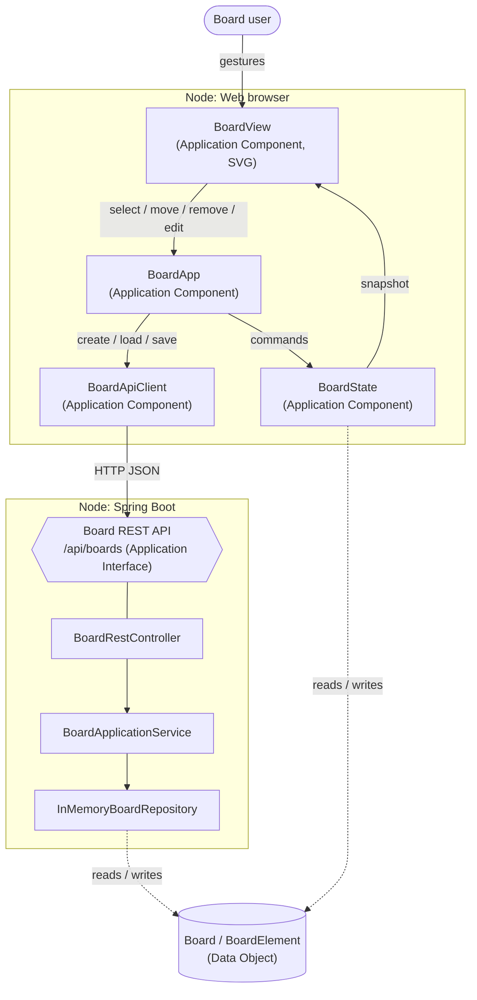
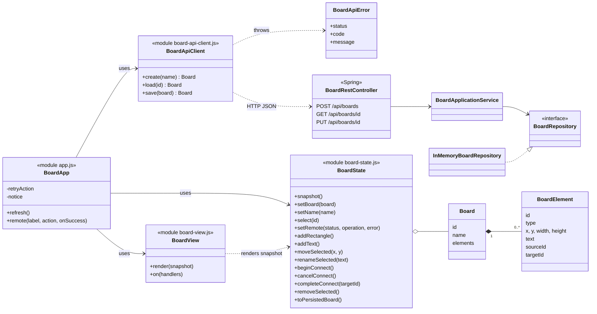

# Architecture Evidence — Lab 05

Both diagrams describe the code delivered in this repository. See [ADR-002](../ADR-002-client-boundaries.md).

## 1. Application View (ArchiMate)
Model file: [application-view.archimate.xml](application-view.archimate.xml) (Open Exchange Format;
import it in Archi with *File → Import → Open Exchange XML Model* and export the PNG next to it if required).

Simplified rendering of the same view:

Lab #6 will add a realtime adapter next to `BoardApiClient` that feeds `BoardState`; `BoardView` stays unchanged.

## 2. Class / module diagram

`BoardApiClient`, `BoardState` and `BoardView` do not depend on each other; only `BoardApp` composes them.
