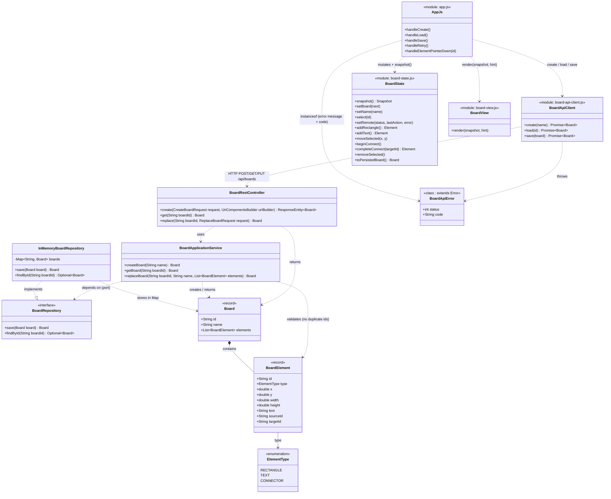

# Class / Module Diagram

Renders natively on GitHub. Scope is limited to what explains the real
dependencies between layers (backend Lab 04 + client Lab 05) — not a full
class inventory. Getters/setters, Spring annotations, DTO validation
annotations and private helpers are intentionally omitted; see
`docs/ADR-001-repository-boundary.md` and `docs/ADR-002-client-boundaries.md`
for the reasoning behind each boundary shown here.

## Reading notes

- `BoardApiClient ..> BoardRestController` is not a compile-time import (JS
  cannot import a Java class); it represents the real runtime dependency —
  `BoardApiClient` is the only client module whose behavior is defined by
  the wire contract in `docs/api-contract.md`.
- `BoardView` has **no** relationship to `BoardApiClient` or
  `BoardRestController` on purpose: it never calls `fetch` and never
  imports the API client (see ADR-002). Its only dependency is on the
  snapshot shape it receives as a plain argument, which is why it is not
  drawn as depending on `BoardState` either — `AppJs` is the sole module
  that reads `BoardState` and hands the result to `BoardView`.
- `AppJs` lists a representative subset of its `handle*` functions (the
  ones that call `BoardApiClient` plus the one that decides
  select-vs-connect); the remaining handlers
  (`handleAddRectangle`, `handleAddText`, `handleDeleteSelected`,
  `handleConnectClick`, `handleElementDrag`, `handleCanvasPointerDown`,
  `handleRenameChange`) all follow the same `state.*()` → `renderAll()`
  shape already covered by the `AppJs ..> BoardState` relationship.
